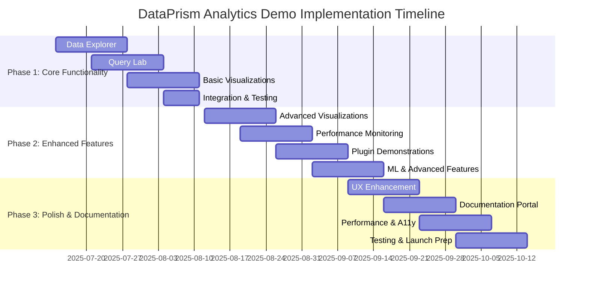
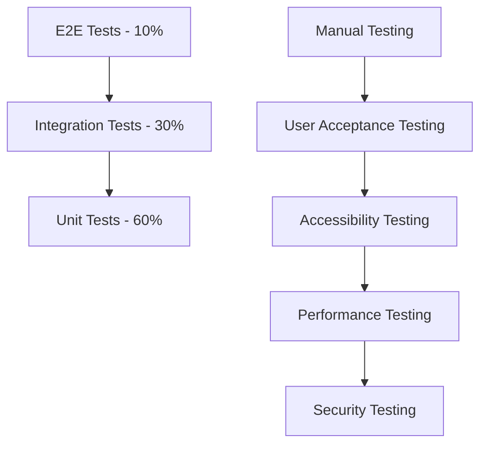

# DataPrism Analytics Demo - Master Implementation Roadmap

## Document Information
- **Project**: DataPrism Analytics Demo Application
- **Document Type**: Master Implementation Roadmap
- **Version**: 1.0
- **Date**: 2025-07-13
- **Status**: Planning

## Executive Summary

This master roadmap orchestrates the three-phase development of the DataPrism Analytics Demo application, transforming it from a beautiful shell into a production-ready showcase of browser-based analytics capabilities. The roadmap balances feature delivery with quality, ensuring each phase builds upon the previous while maintaining user experience standards and technical excellence.

## Overall Project Vision

### Mission Statement
Create a compelling, production-ready demonstration of DataPrism's browser-based analytics capabilities that serves as both a powerful sales tool and comprehensive developer resource, showcasing the platform's ability to deliver desktop-class analytics performance in web browsers.

### Strategic Objectives
1. **Market Validation**: Demonstrate competitive advantages over existing analytics platforms
2. **Developer Adoption**: Provide comprehensive resources for platform adoption
3. **Sales Enablement**: Create compelling demonstration tools for business development
4. **Technical Showcase**: Highlight WebAssembly and modern web technology capabilities
5. **Community Building**: Establish foundation for developer ecosystem growth

## Phase Overview and Dependencies



## Detailed Phase Breakdown

### Phase 1: Core Functionality (6 weeks)
**Duration**: August 14 - September 25, 2025
**Team Size**: 3-4 developers
**Budget**: $120,000 - $160,000

#### Key Deliverables
- ✅ Functional data upload and exploration interface
- ✅ Working SQL query laboratory with syntax highlighting
- ✅ Basic chart creation (bar, line, pie charts)
- ✅ Integration with DataPrism engine (no mocking)
- ✅ Responsive layout with dark/light theme support

#### Success Criteria
- Users can complete end-to-end workflow: upload → query → visualize
- Performance targets met: <2s query execution, <5s file upload
- Cross-browser compatibility verified
- Basic accessibility standards met

#### Critical Path Items
1. **DataPrism Engine Integration** (Week 1)
2. **File Upload & Data Explorer** (Weeks 1-2)
3. **SQL Query Lab** (Weeks 3-4)
4. **Basic Visualization** (Weeks 5-6)

### Phase 2: Enhanced Features (8 weeks)
**Duration**: September 26 - November 21, 2025
**Team Size**: 4-5 developers
**Budget**: $200,000 - $250,000

#### Key Deliverables
- ✅ Advanced visualization library (8+ chart types)
- ✅ Real-time performance monitoring dashboard
- ✅ Plugin system demonstrations (5+ plugins)
- ✅ Machine learning integration
- ✅ Dashboard builder with drag-and-drop interface

#### Success Criteria
- Advanced features demonstrate competitive advantages
- Plugin system showcases platform extensibility
- Performance monitoring provides actionable insights
- ML features work with real datasets

#### Critical Path Items
1. **Advanced Chart Library** (Weeks 1-2)
2. **Dashboard Builder** (Weeks 3-4)
3. **Performance Monitoring** (Weeks 5-6)
4. **Plugin Demonstrations** (Weeks 7-8)

### Phase 3: Polish & Documentation (8 weeks)
**Duration**: November 22, 2025 - January 17, 2026
**Team Size**: 3-4 developers + 2 technical writers
**Budget**: $180,000 - $220,000

#### Key Deliverables
- ✅ Production-ready user experience with guided tutorials
- ✅ Comprehensive documentation portal
- ✅ Video tutorial library
- ✅ WCAG 2.1 AA accessibility compliance
- ✅ Performance optimization and monitoring

#### Success Criteria
- 90% task completion rate without assistance
- Comprehensive documentation enables self-service adoption
- Accessibility standards fully met
- Performance budgets consistently achieved

#### Critical Path Items
1. **User Experience Enhancement** (Weeks 1-2)
2. **Documentation Portal** (Weeks 3-4)
3. **Performance & Accessibility** (Weeks 5-6)
4. **Testing & Launch Preparation** (Weeks 7-8)

## Resource Allocation

### Development Team Structure

#### Phase 1 Team (3-4 developers)
- **Lead Frontend Developer**: React/TypeScript expert with data visualization experience
- **Backend Integration Developer**: Experience with WebAssembly and database integration
- **UI/UX Developer**: Strong CSS/design skills for responsive layouts
- **DevOps Engineer** (part-time): Build pipeline and deployment automation

#### Phase 2 Team (4-5 developers)
- **All Phase 1 team members continue**
- **Data Visualization Specialist**: D3.js, Chart.js, advanced visualization libraries
- **Performance Engineer**: WebAssembly optimization, browser performance tuning

#### Phase 3 Team (3-4 developers + 2 writers)
- **Lead Frontend Developer** (continues)
- **Accessibility Specialist**: WCAG compliance, screen reader testing
- **Performance Engineer** (continues)
- **Technical Writer**: API documentation, developer guides
- **Content Creator**: Video tutorials, marketing materials

### Technology Stack

#### Core Technologies
```typescript
// Frontend Framework
React 18+ with TypeScript
Vite for build tooling
Tailwind CSS for styling

// Data Visualization
D3.js for custom visualizations
Chart.js for standard charts
Plotly.js for advanced 3D charts
@observablehq/plot for grammar of graphics

// DataPrism Integration
WebAssembly runtime
DuckDB-WASM for analytics
Custom WASM bindings

// State Management
React Context for app state
TanStack Query for server state
LocalStorage for persistence

// Development Tools
ESLint + Prettier for code quality
Jest + Testing Library for unit tests
Playwright for E2E testing
Storybook for component development
```

#### Infrastructure Requirements
```yaml
# Development Environment
- Node.js 18+ with npm/yarn
- Rust toolchain for WASM compilation
- Docker for local development
- Git with conventional commits

# CI/CD Pipeline
- GitHub Actions for automation
- Automated testing on multiple browsers
- Performance regression testing
- Security vulnerability scanning

# Deployment & Hosting
- CDN for global asset distribution
- SSL/TLS with security headers
- Analytics and error monitoring
- A/B testing infrastructure
```

## Quality Assurance Strategy

### Testing Pyramid



#### Automated Testing Strategy
- **Unit Tests**: 90% coverage for business logic and utilities
- **Integration Tests**: DataPrism engine integration, API interactions
- **E2E Tests**: Critical user journeys across browsers
- **Visual Regression**: UI consistency across updates
- **Performance Tests**: Benchmark validation and regression detection

#### Manual Testing Strategy
- **User Acceptance Testing**: Real users testing key workflows
- **Accessibility Testing**: Screen reader and keyboard navigation
- **Cross-browser Testing**: Chrome, Firefox, Safari, Edge
- **Mobile Testing**: iOS Safari, Android Chrome
- **Security Testing**: Penetration testing and vulnerability assessment

### Performance Standards

#### Core Web Vitals Targets
```typescript
interface PerformanceTargets {
  firstContentfulPaint: 1500; // ms
  largestContentfulPaint: 2500; // ms
  cumulativeLayoutShift: 0.1; // score
  firstInputDelay: 100; // ms
  totalBlockingTime: 200; // ms
}
```

#### Application Performance Targets
```typescript
interface ApplicationTargets {
  fileUpload: {
    small: 2000; // <1MB files in 2s
    medium: 5000; // 1-5MB files in 5s
    large: 10000; // 5-10MB files in 10s
  };
  queryExecution: {
    simple: 500; // Basic SELECT in 500ms
    complex: 2000; // JOINs and aggregations in 2s
    analytical: 5000; // Complex analytics in 5s
  };
  visualization: {
    basic: 500; // Simple charts in 500ms
    advanced: 1000; // Complex charts in 1s
    dashboard: 2000; // Full dashboard in 2s
  };
}
```

## Risk Management

### Technical Risks

| Risk | Probability | Impact | Mitigation Strategy | Contingency Plan |
|------|-------------|--------|-------------------|------------------|
| WebAssembly browser compatibility | Medium | High | Comprehensive browser testing, fallback implementations | Server-side processing fallback |
| Performance degradation with large datasets | High | Medium | Performance budgets, automated testing | Data sampling and pagination |
| WASM memory management issues | Medium | High | Memory monitoring, garbage collection optimization | Memory usage warnings and cleanup |
| Third-party library breaking changes | Low | Medium | Dependency version pinning, automated security updates | Library replacement or forking |
| Cross-browser CSS inconsistencies | Medium | Low | CSS-in-JS, automated visual regression testing | Browser-specific polyfills |

### Project Risks

| Risk | Probability | Impact | Mitigation Strategy | Contingency Plan |
|------|-------------|--------|-------------------|------------------|
| Scope creep from stakeholder requests | High | Medium | Clear phase definitions, change control process | Additional development sprints |
| Key developer unavailability | Medium | High | Knowledge documentation, pair programming | External contractor onboarding |
| DataPrism engine API changes | Medium | High | Close collaboration with core team | API abstraction layer |
| Design iteration delays | Medium | Medium | Early user testing, design system establishment | Simplified UI fallback |
| Performance regression in dependencies | Low | High | Automated performance testing | Dependency rollback procedures |

### Business Risks

| Risk | Probability | Impact | Mitigation Strategy | Contingency Plan |
|------|-------------|--------|-------------------|------------------|
| Competitive feature launches | Medium | Medium | Market monitoring, differentiation focus | Accelerated feature development |
| Changed market requirements | Low | High | User research, market analysis | Pivot to new requirements |
| Budget overruns | Medium | High | Regular budget reviews, scope management | Phase prioritization and cuts |
| Timeline delays affecting product launch | Medium | High | Buffer time allocation, parallel development | Phased launch strategy |

## Success Metrics and KPIs

### Development Metrics

#### Velocity and Quality
```typescript
interface DevelopmentMetrics {
  velocity: {
    storyPointsPerSprint: number;
    featuresCompletedPerWeek: number;
    bugFixTimeAverage: number; // hours
  };
  quality: {
    testCoverage: number; // percentage
    bugEscapeRate: number; // percentage
    codeReviewCoverage: number; // percentage
    technicalDebtRatio: number; // percentage
  };
  performance: {
    buildTime: number; // minutes
    deploymentTime: number; // minutes
    hotReloadTime: number; // seconds
  };
}
```

#### User Experience Metrics
```typescript
interface UserExperienceMetrics {
  usability: {
    taskCompletionRate: number; // percentage
    timeToFirstValue: number; // seconds
    userErrorRate: number; // percentage
    featureDiscoveryRate: number; // percentage
  };
  engagement: {
    sessionDuration: number; // minutes
    featuresUsedPerSession: number;
    returnUserRate: number; // percentage
    tutorialCompletionRate: number; // percentage
  };
  satisfaction: {
    netPromoterScore: number; // -100 to 100
    systemUsabilityScale: number; // 0 to 100
    taskDifficultyRating: number; // 1 to 7
  };
}
```

### Business Impact Metrics

#### Market Response
- **Demo Effectiveness**: Conversion rate from demo to product interest
- **Developer Adoption**: GitHub stars, npm downloads, community engagement
- **Sales Enablement**: Demo usage in sales processes, customer feedback
- **Competitive Positioning**: Feature comparison advantages, market differentiation

#### Technical Achievement
- **Performance Leadership**: Benchmark comparisons with competitors
- **Innovation Showcase**: WebAssembly adoption, browser technology advancement
- **Ecosystem Growth**: Plugin development, third-party integrations
- **Open Source Impact**: Community contributions, developer tools adoption

## Communication and Reporting

### Stakeholder Communication

#### Weekly Reports
- Development progress against milestones
- Key metrics and performance indicators
- Risk assessment and mitigation updates
- Blockers and dependency status

#### Monthly Reviews
- Phase progress and completion status
- Budget utilization and forecasting
- User feedback and testing results
- Strategic alignment and course corrections

#### Quarterly Business Reviews
- Overall project health and trajectory
- Market feedback and competitive analysis
- ROI projections and business impact
- Next phase planning and resource allocation

### Documentation Standards

#### Technical Documentation
- Architecture Decision Records (ADRs)
- API documentation with examples
- Performance benchmark reports
- Security assessment findings

#### Project Documentation
- Sprint planning and retrospectives
- User research and testing reports
- Design system and style guides
- Deployment and operational procedures

## Launch Strategy

### Phased Launch Approach

#### Phase 1 Launch: Internal Demo (Week 7)
- **Audience**: Internal teams, key stakeholders
- **Goals**: Validate core functionality, gather initial feedback
- **Success Criteria**: Core workflows functional, basic performance targets met

#### Phase 2 Launch: Beta Release (Week 15)
- **Audience**: Selected customers, developer community
- **Goals**: Validate advanced features, stress test performance
- **Success Criteria**: Advanced features compelling, performance under load

#### Phase 3 Launch: Public Release (Week 23)
- **Audience**: General public, developer community, potential customers
- **Goals**: Market validation, lead generation, community building
- **Success Criteria**: Production-ready quality, positive market response

### Marketing and Promotion

#### Developer Community
- Technical blog posts on WebAssembly innovation
- Conference presentations at web development events
- Open source contributions and community engagement
- Developer tool integrations and partnerships

#### Business Community
- Industry analyst briefings and demonstrations
- Customer case studies and success stories
- Partnership announcements and integrations
- Trade show presentations and demos

## Post-Launch Evolution

### Continuous Improvement Process

#### User Feedback Integration
- Monthly user research sessions
- Quarterly feature prioritization reviews
- Continuous A/B testing of new features
- Community-driven feature requests

#### Technical Evolution
- Performance optimization cycles
- Security updates and compliance
- Browser compatibility maintenance
- Technology stack modernization

#### Ecosystem Development
- Plugin marketplace establishment
- Third-party integration development
- Developer tool improvements
- Community contribution programs

### Long-term Roadmap

#### Year 1: Establishment
- Stable production release
- Growing developer community
- Customer adoption validation
- Competitive feature parity

#### Year 2: Innovation
- Advanced ML/AI capabilities
- Real-time collaboration features
- Enterprise security and compliance
- Mobile-first optimizations

#### Year 3: Leadership
- Industry-leading performance
- Comprehensive ecosystem
- Market leadership position
- Next-generation web standards

This master roadmap provides the strategic framework for delivering a world-class DataPrism Analytics Demo that showcases the platform's capabilities while establishing a foundation for long-term market success and developer adoption.