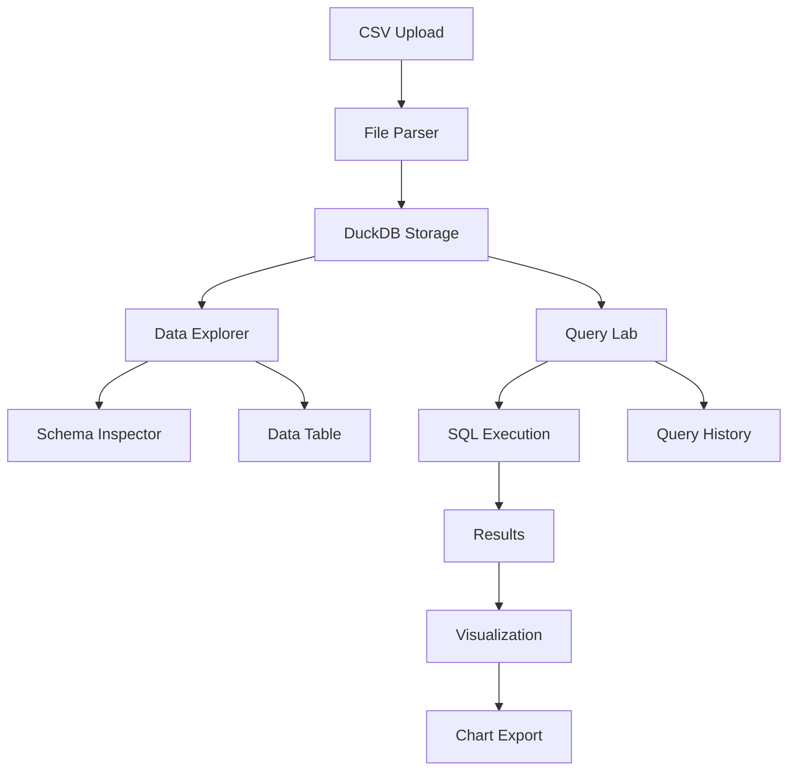

# DataPrism Analytics Demo - Phase 1: Core Functionality PRP

## Document Information
- **Project**: DataPrism Analytics Demo Application
- **Phase**: 1 - Core Functionality
- **Version**: 1.0
- **Date**: 2025-07-13
- **Status**: Planning

## Executive Summary

Phase 1 focuses on implementing the essential data analytics functionality that transforms the current demo app from a beautiful shell into a working analytics platform. This phase delivers the minimum viable product (MVP) that demonstrates DataPrism's core capabilities: data exploration, SQL querying, and basic visualization.

## Success Criteria

### Primary Goals
- ✅ Users can upload and explore CSV datasets
- ✅ Users can execute SQL queries against loaded data
- ✅ Users can create basic visualizations from query results
- ✅ All core DataPrism engine features are functional
- ✅ Demo showcases real browser-based analytics capabilities

### Key Performance Indicators
- **Data Loading**: Support files up to 10MB, 100K+ rows
- **Query Performance**: Sub-2 second response for typical queries
- **User Experience**: Intuitive workflow from data → query → visualization
- **Reliability**: 95% success rate for data operations
- **Browser Support**: Works in Chrome 90+, Firefox 88+, Safari 14+

## Feature Requirements

### 1. Data Explorer Page

#### 1.1 File Upload Interface
**Priority**: P0 (Critical)
**Estimated Effort**: 3 days

**Requirements**:
- Drag-and-drop CSV file upload area
- File validation (type, size limits)
- Upload progress indicators
- Error handling for malformed files
- Support for common CSV formats and delimiters

**Acceptance Criteria**:
- Users can drag CSV files onto the upload zone
- Files are validated before processing (max 10MB, .csv extension)
- Progress bar shows upload and parsing status
- Clear error messages for invalid files
- Uploaded data is automatically parsed and loaded into DuckDB

**Technical Specifications**:
```typescript
interface FileUploadComponent {
  acceptedFormats: string[];
  maxFileSize: number;
  onUpload: (file: File) => Promise<void>;
  onProgress: (progress: number) => void;
  onError: (error: Error) => void;
}
```

#### 1.2 Data Preview and Table Browser
**Priority**: P0 (Critical)
**Estimated Effort**: 4 days

**Requirements**:
- Tabular data display with pagination
- Column headers with data types
- Row count and dataset statistics
- Search and filter functionality
- Column sorting capabilities

**Acceptance Criteria**:
- Display first 100 rows of uploaded data
- Show column names and inferred data types
- Pagination controls for large datasets
- Global search across all columns
- Click column headers to sort ascending/descending
- Display total row count and dataset size

**Technical Specifications**:
```typescript
interface DataTableComponent {
  data: any[];
  columns: ColumnDefinition[];
  pagination: PaginationConfig;
  onSort: (column: string, direction: 'asc' | 'desc') => void;
  onFilter: (searchTerm: string) => void;
}

interface ColumnDefinition {
  name: string;
  type: 'string' | 'number' | 'date' | 'boolean';
  nullable: boolean;
}
```

#### 1.3 Schema Inspector
**Priority**: P1 (Important)
**Estimated Effort**: 2 days

**Requirements**:
- Display table schema information
- Show column statistics (min, max, avg, null count)
- Data profiling for data quality assessment
- Export schema as JSON/CSV

**Acceptance Criteria**:
- Schema panel shows all columns with types
- Statistics panel displays summary stats per column
- Data quality indicators (null percentage, unique values)
- Export button downloads schema definition

### 2. Query Lab Page

#### 2.1 SQL Editor
**Priority**: P0 (Critical)
**Estimated Effort**: 4 days

**Requirements**:
- Syntax-highlighted SQL editor
- Basic auto-completion for SQL keywords
- Query execution with results display
- Error handling and validation
- Query history functionality

**Acceptance Criteria**:
- Monaco Editor or CodeMirror integration for SQL
- Syntax highlighting for SQL keywords and functions
- Execute button runs queries against loaded datasets
- Results displayed in tabular format below editor
- Clear error messages for invalid SQL
- Recent queries saved in browser localStorage

**Technical Specifications**:
```typescript
interface SQLEditor {
  value: string;
  onChange: (sql: string) => void;
  onExecute: (sql: string) => Promise<QueryResult>;
  language: 'sql';
  theme: 'light' | 'dark';
}

interface QueryResult {
  data: any[];
  metadata: {
    rowCount: number;
    executionTime: number;
    columns: ColumnDefinition[];
  };
  error?: string;
}
```

#### 2.2 Results Display
**Priority**: P0 (Critical)
**Estimated Effort**: 3 days

**Requirements**:
- Tabular results with sorting and filtering
- Export results as CSV/JSON
- Query execution metrics display
- Result pagination for large datasets

**Acceptance Criteria**:
- Query results appear in sortable table
- Export buttons download results in multiple formats
- Execution time and row count displayed
- Pagination for results with 1000+ rows
- Copy-to-clipboard functionality

#### 2.3 Query Management
**Priority**: P1 (Important)
**Estimated Effort**: 2 days

**Requirements**:
- Save and name queries
- Query history with timestamps
- Load saved queries
- Delete unwanted queries

**Acceptance Criteria**:
- Save button prompts for query name
- Sidebar shows saved queries list
- Click saved query to load in editor
- Delete button removes saved queries
- History shows last 20 executed queries

### 3. Basic Visualizations Page

#### 3.1 Chart Type Selection
**Priority**: P0 (Critical)
**Estimated Effort**: 3 days

**Requirements**:
- Support for bar charts, line charts, and pie charts
- Data binding interface for chart configuration
- Integration with query results from Query Lab
- Real-time chart updates when data changes

**Acceptance Criteria**:
- Chart type selector with preview icons
- Drag-and-drop field mapping for X/Y axes
- Live preview of chart as user configures
- Charts update automatically when underlying data changes
- Support for both categorical and numerical data

**Technical Specifications**:
```typescript
interface ChartConfig {
  type: 'bar' | 'line' | 'pie';
  data: any[];
  xAxis: string;
  yAxis: string;
  groupBy?: string;
  aggregation?: 'sum' | 'avg' | 'count' | 'min' | 'max';
}

interface VisualizationComponent {
  config: ChartConfig;
  onConfigChange: (config: ChartConfig) => void;
  width?: number;
  height?: number;
}
```

#### 3.2 Chart Configuration
**Priority**: P0 (Critical)
**Estimated Effort**: 3 days

**Requirements**:
- Field mapping interface (drag-and-drop or dropdown)
- Chart styling options (colors, labels, legends)
- Data aggregation options (sum, average, count)
- Chart export functionality (PNG, SVG)

**Acceptance Criteria**:
- Intuitive field mapping with data type validation
- Color picker for chart aesthetics
- Aggregation dropdown for numerical fields
- Export button saves charts as images
- Chart title and axis labels are editable

#### 3.3 Chart Library Integration
**Priority**: P0 (Critical)
**Estimated Effort**: 2 days

**Requirements**:
- Integration with Chart.js or Recharts
- Responsive chart sizing
- Tooltip and interaction support
- Theme-aware styling (light/dark mode)

**Acceptance Criteria**:
- Charts render correctly in both light and dark themes
- Charts resize automatically with container
- Hover tooltips show data point details
- Click interactions select/highlight data points
- Charts maintain aspect ratio on different screen sizes

## Technical Architecture

### Frontend Components

```
src/pages/
├── DataExplorerPage.tsx          # Main data exploration interface
├── QueryLabPage.tsx              # SQL query interface
└── VisualizationPage.tsx         # Chart creation interface

src/components/
├── data-explorer/
│   ├── FileUploader.tsx         # Drag-and-drop file upload
│   ├── DataTable.tsx            # Paginated data display
│   ├── SchemaInspector.tsx      # Schema and stats viewer
│   └── FilterPanel.tsx          # Data filtering controls
├── query-lab/
│   ├── SQLEditor.tsx            # Monaco/CodeMirror SQL editor
│   ├── ResultsTable.tsx         # Query results display
│   ├── QueryHistory.tsx         # Saved/recent queries
│   └── QueryMetrics.tsx         # Performance metrics
└── visualization/
    ├── ChartTypeSelector.tsx    # Chart type picker
    ├── FieldMapper.tsx          # Data field binding
    ├── ChartRenderer.tsx        # Chart.js/Recharts wrapper
    └── ChartExporter.tsx        # Export functionality
```

### Data Flow



### DataPrism Integration

#### File Processing Pipeline
```typescript
// File upload to DuckDB integration
const uploadFile = async (file: File) => {
  const csvText = await file.text();
  const tableName = file.name.replace('.csv', '');
  
  // Parse CSV and infer schema
  const parsed = Papa.parse(csvText, { header: true, dynamicTyping: true });
  
  // Load into DataPrism engine
  await dataPrismEngine.loadData(parsed.data, tableName);
  
  // Update UI with new table
  setAvailableTables(await dataPrismEngine.listTables());
};
```

#### Query Execution
```typescript
// SQL query execution
const executeQuery = async (sql: string) => {
  const startTime = performance.now();
  
  try {
    const result = await dataPrismEngine.query(sql);
    const executionTime = performance.now() - startTime;
    
    return {
      ...result,
      metadata: {
        ...result.metadata,
        executionTime
      }
    };
  } catch (error) {
    throw new QueryError(error.message);
  }
};
```

## Dependencies and Libraries

### New Dependencies
```json
{
  "dependencies": {
    "@monaco-editor/react": "^4.6.0",
    "papaparse": "^5.4.1",
    "chart.js": "^4.4.0",
    "react-chartjs-2": "^5.2.0",
    "react-dropzone": "^14.2.3"
  },
  "devDependencies": {
    "@types/papaparse": "^5.3.7"
  }
}
```

### Existing Dependencies (Already Available)
- React Router DOM - Navigation
- Tailwind CSS - Styling
- Lucide React - Icons
- @tanstack/react-table - Table components
- @tanstack/react-query - Data fetching

## Testing Strategy

### Unit Tests
- File upload validation
- CSV parsing accuracy
- SQL query execution
- Chart rendering with different data types

### Integration Tests
- End-to-end data flow: upload → query → visualize
- DataPrism engine integration
- Browser compatibility testing

### Performance Tests
- Large file upload (5-10MB CSV files)
- Complex query execution times
- Chart rendering with 10K+ data points
- Memory usage monitoring

## Risks and Mitigation

### Technical Risks

| Risk | Impact | Likelihood | Mitigation |
|------|--------|------------|------------|
| Large file upload performance | High | Medium | Implement chunked processing and web workers |
| Query execution timeouts | High | Low | Add query timeout controls and optimization hints |
| Chart rendering performance | Medium | Medium | Implement data sampling for large datasets |
| Browser memory limits | High | Medium | Add memory monitoring and data cleanup |

### User Experience Risks

| Risk | Impact | Likelihood | Mitigation |
|------|--------|------------|------------|
| Complex data upload workflow | Medium | Low | Comprehensive user testing and iteration |
| SQL learning curve | Medium | High | Provide query examples and templates |
| Chart configuration complexity | Medium | Medium | Implement smart defaults and presets |

## Success Metrics

### Functional Metrics
- ✅ 100% of core features implemented and tested
- ✅ All acceptance criteria met
- ✅ Cross-browser compatibility verified
- ✅ Performance benchmarks achieved

### User Experience Metrics
- 📊 Average time from file upload to first visualization < 2 minutes
- 📊 SQL query success rate > 90%
- 📊 Chart creation success rate > 95%
- 📊 User can complete end-to-end workflow without assistance

### Technical Metrics
- ⚡ File upload processing time < 5 seconds for 1MB files
- ⚡ Query execution time < 2 seconds for typical analytical queries
- ⚡ Chart rendering time < 1 second for datasets under 10K rows
- 💾 Memory usage stays under 500MB for typical workflows

## Delivery Timeline

### Week 1-2: Data Explorer Implementation
- Day 1-3: File upload interface and CSV parsing
- Day 4-6: Data table display with pagination
- Day 7-10: Schema inspector and data profiling

### Week 3-4: Query Lab Implementation  
- Day 11-14: SQL editor with syntax highlighting
- Day 15-17: Query execution and results display
- Day 18-20: Query history and management

### Week 5-6: Basic Visualizations
- Day 21-23: Chart type selection and configuration
- Day 24-26: Chart rendering and export
- Day 27-30: Integration testing and polish

### Buffer Time: 1 week for testing, bug fixes, and performance optimization

## Post-Phase 1 Considerations

### Immediate Next Steps (Phase 2)
- Advanced visualization types (scatter plots, heatmaps)
- Real-time data updates and streaming
- Plugin system integration
- Performance monitoring dashboard

### Technical Debt Items
- Implement proper error boundaries for each feature
- Add comprehensive logging and analytics
- Optimize bundle size and loading performance
- Implement proper accessibility features

This Phase 1 implementation will establish DataPrism Analytics Demo as a functional data analytics platform, demonstrating the core value proposition of browser-based, high-performance data processing and visualization.