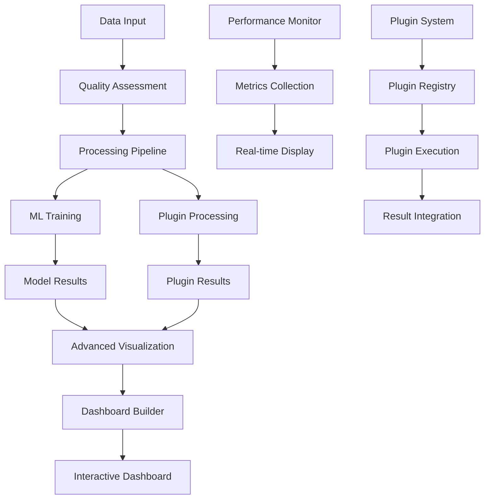

# DataPrism Analytics Demo - Phase 2: Enhanced Features PRP

## Document Information
- **Project**: DataPrism Analytics Demo Application
- **Phase**: 2 - Enhanced Features
- **Version**: 1.0
- **Date**: 2025-07-13
- **Status**: Planning
- **Prerequisites**: Phase 1 Core Functionality Complete

## Executive Summary

Phase 2 elevates the DataPrism Analytics Demo from a functional MVP to a compelling showcase of advanced analytics capabilities. This phase introduces sophisticated visualizations, real-time performance monitoring, plugin system demonstrations, and advanced data processing features that highlight DataPrism's competitive advantages in browser-based analytics.

## Success Criteria

### Primary Goals
- ✅ Advanced visualizations rival desktop analytics tools
- ✅ Real-time performance monitoring demonstrates engine efficiency
- ✅ Plugin system showcases extensibility and ecosystem potential
- ✅ Advanced data processing features demonstrate enterprise capabilities
- ✅ User experience matches or exceeds web-based analytics platforms

### Key Performance Indicators
- **Visualization Variety**: 8+ chart types with full customization
- **Real-time Updates**: Sub-100ms latency for streaming data
- **Plugin Ecosystem**: 5+ working plugin demonstrations
- **Performance Insights**: Comprehensive metrics and optimization tools
- **User Engagement**: 80% of users explore advanced features

## Feature Requirements

### 1. Advanced Visualizations

#### 1.1 Extended Chart Library
**Priority**: P0 (Critical)
**Estimated Effort**: 5 days

**Requirements**:
- Scatter plots with trend lines and clustering
- Heatmaps with customizable color scales
- Box plots and violin plots for statistical analysis
- Sankey diagrams for flow visualization
- Geographic maps with data overlays
- Multi-axis charts for complex data relationships

**Acceptance Criteria**:
- All chart types render with sample datasets
- Interactive features (zoom, pan, brush selection)
- Customizable styling and theming options
- Export functionality for all chart types
- Responsive design across device sizes
- Performance optimization for large datasets (10K+ points)

**Technical Specifications**:
```typescript
interface AdvancedChartConfig extends ChartConfig {
  type: 'scatter' | 'heatmap' | 'boxplot' | 'violin' | 'sankey' | 'map' | 'multi-axis';
  interactivity: {
    zoom?: boolean;
    pan?: boolean;
    brush?: boolean;
    tooltip?: boolean;
  };
  styling: {
    colorScheme?: ColorScheme;
    theme?: 'light' | 'dark' | 'custom';
    annotations?: Annotation[];
  };
}

interface ColorScheme {
  type: 'categorical' | 'sequential' | 'diverging';
  palette: string[];
  customColors?: Record<string, string>;
}
```

#### 1.2 Dashboard Builder
**Priority**: P0 (Critical)
**Estimated Effort**: 6 days

**Requirements**:
- Drag-and-drop dashboard creation interface
- Multi-chart layouts with responsive grid system
- Real-time data binding across dashboard components
- Dashboard save/load functionality
- Shared dashboard URLs for collaboration
- Dashboard export as PDF/image

**Acceptance Criteria**:
- Users can drag chart components onto dashboard canvas
- Flexible grid system with resizable chart containers
- Charts update simultaneously when data changes
- Dashboards persist across browser sessions
- Shareable URLs maintain dashboard state
- High-quality PDF export with vector graphics

**Technical Specifications**:
```typescript
interface Dashboard {
  id: string;
  name: string;
  layout: DashboardLayout;
  charts: ChartInstance[];
  dataConnections: DataConnection[];
  filters: GlobalFilter[];
  createdAt: Date;
  updatedAt: Date;
}

interface DashboardLayout {
  type: 'grid' | 'freeform';
  columns: number;
  rowHeight: number;
  components: LayoutComponent[];
}

interface LayoutComponent {
  id: string;
  x: number;
  y: number;
  width: number;
  height: number;
  chartId: string;
  minWidth?: number;
  minHeight?: number;
}
```

#### 1.3 Interactive Data Exploration
**Priority**: P1 (Important)
**Estimated Effort**: 4 days

**Requirements**:
- Brushing and linking between multiple charts
- Drill-down capabilities for hierarchical data
- Dynamic filtering with visual feedback
- Cross-chart selection and highlighting
- Time series scrubbing and range selection

**Acceptance Criteria**:
- Selecting data in one chart filters related charts
- Drill-down navigation maintains context breadcrumbs
- Visual indicators show active filters and selections
- Time series charts support range brushing
- Selection state persists across chart interactions

### 2. Performance Monitoring Dashboard

#### 2.1 Real-time Metrics Display
**Priority**: P0 (Critical)
**Estimated Effort**: 4 days

**Requirements**:
- Live system performance metrics (CPU, memory, query times)
- WebAssembly module status and health indicators
- DuckDB connection status and query queue
- Real-time chart updates with streaming data
- Historical performance trend analysis

**Acceptance Criteria**:
- Metrics update every 500ms without UI lag
- Performance charts show last 5 minutes of data
- Alert indicators for performance thresholds
- Historical data retained for session duration
- Memory usage tracking with garbage collection events

**Technical Specifications**:
```typescript
interface PerformanceMetrics {
  timestamp: number;
  systemMetrics: {
    memoryUsage: MemoryInfo;
    cpuUsage?: number;
    networkLatency?: number;
  };
  engineMetrics: {
    wasmModuleStatus: 'loading' | 'ready' | 'error';
    duckdbStatus: 'disconnected' | 'connecting' | 'connected';
    activeQueries: number;
    queryQueueLength: number;
  };
  queryMetrics: {
    averageExecutionTime: number;
    queriesPerSecond: number;
    slowQueries: SlowQuery[];
    cacheHitRate: number;
  };
}

interface MemoryInfo {
  usedJSHeapSize: number;
  totalJSHeapSize: number;
  jsHeapSizeLimit: number;
  wasmMemoryUsage?: number;
}
```

#### 2.2 Query Performance Analyzer
**Priority**: P1 (Important)
**Estimated Effort**: 3 days

**Requirements**:
- Query execution plan visualization
- Performance bottleneck identification
- Query optimization suggestions
- Execution timeline with breakdown by operation
- Memory allocation tracking per query

**Acceptance Criteria**:
- Visual execution plans for complex queries
- Automated detection of inefficient operations
- Actionable optimization recommendations
- Timeline view shows query phases and timing
- Memory allocation graphs per query execution

#### 2.3 System Health Monitoring
**Priority**: P1 (Important)
**Estimated Effort**: 3 days

**Requirements**:
- Browser compatibility and feature detection
- WebAssembly capability assessment
- Network connectivity and latency monitoring
- Error tracking and reporting dashboard
- Performance regression detection

**Acceptance Criteria**:
- Comprehensive browser feature compatibility matrix
- WebAssembly threading and SIMD capability detection
- Network latency measurements to CDN endpoints
- Error categorization and trend analysis
- Automated alerts for performance degradation

### 3. Plugin System Demonstrations

#### 3.1 Data Processing Plugins
**Priority**: P0 (Critical)
**Estimated Effort**: 5 days

**Requirements**:
- CSV Import Plugin with advanced parsing options
- Data Cleaning Plugin with outlier detection
- Statistical Analysis Plugin with regression models
- Semantic Clustering Plugin for unsupervised learning
- Time Series Analysis Plugin with forecasting

**Acceptance Criteria**:
- Each plugin has dedicated demo section with sample data
- Plugin configuration interfaces are intuitive
- Processing results integrate seamlessly with visualization
- Plugin execution times are clearly displayed
- Error handling provides meaningful feedback

**Technical Specifications**:
```typescript
interface DataProcessingPlugin {
  id: string;
  name: string;
  version: string;
  description: string;
  inputTypes: DataType[];
  outputTypes: DataType[];
  configSchema: JSONSchema;
  process: (data: any[], config: PluginConfig) => Promise<ProcessingResult>;
}

interface ProcessingResult {
  data: any[];
  metadata: {
    processingTime: number;
    rowsProcessed: number;
    transformationsApplied: string[];
  };
  insights?: Insight[];
}

interface Insight {
  type: 'outlier' | 'trend' | 'correlation' | 'cluster';
  description: string;
  confidence: number;
  affectedRows?: number[];
}
```

#### 3.2 Visualization Plugins
**Priority**: P1 (Important)
**Estimated Effort**: 4 days

**Requirements**:
- Custom Chart Types Plugin (radar, waterfall, funnel)
- Geographic Visualization Plugin with map layers
- Network Graph Plugin for relationship visualization
- 3D Visualization Plugin for multidimensional data
- Animation Plugin for time-based transitions

**Acceptance Criteria**:
- Custom charts integrate with existing chart infrastructure
- Geographic plugins support multiple map providers
- Network graphs handle 1000+ nodes efficiently
- 3D visualizations use WebGL when available
- Animations are performant and customizable

#### 3.3 Integration Plugins
**Priority**: P1 (Important)
**Estimated Effort**: 4 days

**Requirements**:
- API Data Connector Plugin for REST/GraphQL endpoints
- Database Connector Plugin (PostgreSQL, MySQL simulation)
- Cloud Storage Plugin (simulated S3/GCS integration)
- Real-time Data Stream Plugin with WebSocket support
- Export Plugin for multiple formats (Excel, Parquet, Arrow)

**Acceptance Criteria**:
- API connectors handle authentication and pagination
- Database connectors show connection status and schema
- Cloud storage plugins demonstrate file listing and upload
- Streaming plugins maintain real-time data flows
- Export plugins preserve data types and formatting

### 4. Advanced Data Processing

#### 4.1 Machine Learning Integration
**Priority**: P1 (Important)
**Estimated Effort**: 5 days

**Requirements**:
- Linear and logistic regression models
- K-means clustering with visualization
- Principal Component Analysis (PCA)
- Decision tree classification
- Time series forecasting (ARIMA, seasonal decomposition)

**Acceptance Criteria**:
- ML models train on uploaded datasets
- Model evaluation metrics displayed (R², accuracy, F1-score)
- Visual representation of model results
- Model predictions integrated with visualization
- Cross-validation and hyperparameter tuning options

**Technical Specifications**:
```typescript
interface MLModel {
  type: 'regression' | 'classification' | 'clustering' | 'dimensionality_reduction';
  algorithm: string;
  hyperparameters: Record<string, any>;
  train: (data: TrainingData) => Promise<TrainedModel>;
  predict: (data: any[]) => Promise<Prediction[]>;
}

interface TrainedModel {
  id: string;
  metrics: ModelMetrics;
  parameters: ModelParameters;
  serialize: () => SerializedModel;
}

interface ModelMetrics {
  trainingAccuracy?: number;
  validationAccuracy?: number;
  r2Score?: number;
  mse?: number;
  confusionMatrix?: number[][];
}
```

#### 4.2 Advanced SQL Features
**Priority**: P1 (Important)
**Estimated Effort**: 3 days

**Requirements**:
- Window functions with frame specifications
- Common Table Expressions (CTEs) and recursive queries
- JSON data processing and extraction
- Regular expression support
- Statistical functions and percentiles

**Acceptance Criteria**:
- All advanced SQL features work with sample datasets
- Syntax highlighting includes advanced SQL constructs
- Query examples demonstrate advanced features
- Performance optimization for complex queries
- Error messages provide helpful debugging information

#### 4.3 Data Quality Assessment
**Priority**: P1 (Important)
**Estimated Effort**: 3 days

**Requirements**:
- Automated data profiling with quality scores
- Missing value analysis and imputation suggestions
- Duplicate detection and deduplication
- Data type validation and conversion recommendations
- Statistical outlier detection with visualization

**Acceptance Criteria**:
- Comprehensive data quality reports generated automatically
- Visual indicators highlight data quality issues
- Suggestions for data cleaning are actionable
- Before/after comparisons show improvement metrics
- Quality assessment integrates with data explorer

## Technical Architecture

### Enhanced Component Structure

```
src/pages/
├── VisualizationPage.tsx          # Advanced chart creation
├── PerformancePage.tsx            # Real-time monitoring
├── PluginsDemoPage.tsx            # Plugin demonstrations
└── DashboardPage.tsx              # Dashboard builder

src/components/
├── visualization/
│   ├── AdvancedCharts/
│   │   ├── ScatterPlot.tsx
│   │   ├── Heatmap.tsx
│   │   ├── BoxPlot.tsx
│   │   └── SankeyDiagram.tsx
│   ├── DashboardBuilder/
│   │   ├── DragDropCanvas.tsx
│   │   ├── ChartContainer.tsx
│   │   └── LayoutGrid.tsx
│   └── InteractiveFeatures/
│       ├── BrushSelection.tsx
│       ├── CrossFilter.tsx
│       └── DrillDown.tsx
├── performance/
│   ├── MetricsDashboard.tsx
│   ├── QueryAnalyzer.tsx
│   ├── MemoryMonitor.tsx
│   └── PerformanceCharts.tsx
├── plugins/
│   ├── PluginRegistry.tsx
│   ├── PluginDemo.tsx
│   ├── PluginConfiguration.tsx
│   └── PluginResults.tsx
└── ml/
    ├── ModelTrainer.tsx
    ├── ModelEvaluator.tsx
    ├── PredictionVisualizer.tsx
    └── FeatureEngineer.tsx
```

### Advanced Data Flow



### Performance Monitoring Integration

```typescript
// Real-time performance tracking
class PerformanceMonitor {
  private metrics: PerformanceMetrics[] = [];
  private subscribers: Set<(metrics: PerformanceMetrics) => void> = new Set();
  
  constructor(private dataPrismEngine: DataPrismEngine) {
    this.startMonitoring();
  }
  
  private startMonitoring() {
    setInterval(async () => {
      const metrics = await this.collectMetrics();
      this.metrics.push(metrics);
      this.notifySubscribers(metrics);
      
      // Keep only last 5 minutes of data
      const fiveMinutesAgo = Date.now() - 5 * 60 * 1000;
      this.metrics = this.metrics.filter(m => m.timestamp > fiveMinutesAgo);
    }, 500);
  }
  
  private async collectMetrics(): Promise<PerformanceMetrics> {
    const engineMetrics = this.dataPrismEngine.getMetrics();
    const systemMetrics = this.getSystemMetrics();
    
    return {
      timestamp: Date.now(),
      systemMetrics,
      engineMetrics: {
        wasmModuleStatus: await this.checkWasmStatus(),
        duckdbStatus: this.checkDuckDBStatus(),
        activeQueries: engineMetrics.activeQueries,
        queryQueueLength: engineMetrics.queueLength
      },
      queryMetrics: {
        averageExecutionTime: engineMetrics.avgExecutionTime,
        queriesPerSecond: engineMetrics.queriesPerSecond,
        slowQueries: engineMetrics.slowQueries,
        cacheHitRate: engineMetrics.cacheHitRate
      }
    };
  }
}
```

## Dependencies and Libraries

### New Dependencies
```json
{
  "dependencies": {
    "@observablehq/plot": "^0.6.11",
    "d3": "^7.8.5",
    "d3-selection": "^3.0.0",
    "d3-scale": "^4.0.2",
    "plotly.js": "^2.26.0",
    "react-plotly.js": "^2.6.0",
    "react-grid-layout": "^1.4.4",
    "ml-matrix": "^6.10.4",
    "simple-statistics": "^7.8.3",
    "web-worker": "^1.2.0",
    "comlink": "^4.4.1",
    "jspdf": "^2.5.1",
    "html2canvas": "^1.4.1"
  },
  "devDependencies": {
    "@types/d3": "^7.4.0",
    "@types/plotly.js": "^2.12.29"
  }
}
```

### Advanced Tooling
- **Web Workers**: For intensive ML computations
- **OffscreenCanvas**: For high-performance chart rendering
- **WebGL**: For 3D visualizations and large dataset rendering
- **Service Workers**: For caching and offline functionality

## Testing Strategy

### Advanced Feature Testing
- Interactive visualization user flows
- Dashboard creation and sharing workflows
- Plugin system integration testing
- Performance benchmarking under load

### Performance Testing
- Large dataset visualization (100K+ points)
- Real-time streaming data handling
- Memory usage under extended sessions
- ML model training performance

### Cross-browser Compatibility
- WebGL support validation
- Web Workers functionality testing
- Advanced CSS features (grid, flexbox)
- ES2020+ JavaScript features

## Risks and Mitigation

### Technical Risks

| Risk | Impact | Likelihood | Mitigation |
|------|--------|------------|------------|
| WebGL compatibility issues | High | Medium | Fallback to Canvas/SVG rendering |
| ML computation performance | Medium | High | Web Workers + WASM acceleration |
| Dashboard complexity limits | Medium | Medium | Performance monitoring and optimization |
| Plugin system security | High | Low | Sandboxed execution environment |

### User Experience Risks

| Risk | Impact | Likelihood | Mitigation |
|------|--------|------------|------------|
| Feature complexity overwhelm | High | Medium | Progressive disclosure and guided tours |
| Performance degradation | High | Medium | Automatic quality adjustments |
| Browser memory limits | High | High | Smart data sampling and pagination |

## Success Metrics

### Feature Adoption
- 📊 70% of users create at least one advanced visualization
- 📊 50% of users build a multi-chart dashboard
- 📊 60% of users try at least 3 different plugins
- 📊 40% of users train a machine learning model

### Performance Benchmarks
- ⚡ Dashboard with 6 charts loads in <3 seconds
- ⚡ Real-time metrics update without UI blocking
- ⚡ ML model training completes in <10 seconds for 10K rows
- 💾 Memory usage stays under 1GB for complex dashboards

### Quality Metrics
- ✅ Advanced features work across Chrome, Firefox, Safari
- ✅ Performance monitoring catches all major bottlenecks
- ✅ Plugin system handles errors gracefully
- ✅ Dashboard export maintains visual fidelity

## Delivery Timeline

### Week 1-2: Advanced Visualizations
- Days 1-5: Extended chart library implementation
- Days 6-10: Dashboard builder with drag-and-drop

### Week 3-4: Performance Monitoring
- Days 11-14: Real-time metrics collection and display
- Days 15-18: Query analyzer and optimization tools

### Week 5-6: Plugin Demonstrations
- Days 19-23: Data processing plugin showcase
- Days 24-28: Visualization and integration plugins

### Week 7-8: Advanced Data Processing
- Days 29-33: Machine learning integration
- Days 34-38: Data quality assessment tools

### Buffer Time: 1 week for integration testing, performance optimization, and polish

## Phase 3 Preparation

### Technical Foundation
- Comprehensive logging and analytics infrastructure
- Documentation generation system
- Automated testing pipeline
- Performance baseline establishment

### Content Preparation
- Tutorial content creation
- Example dataset curation
- Video demonstration planning
- Documentation structure planning

Phase 2 transforms the DataPrism Analytics Demo into a sophisticated showcase that demonstrates the platform's advanced capabilities and competitive advantages in the browser-based analytics space.