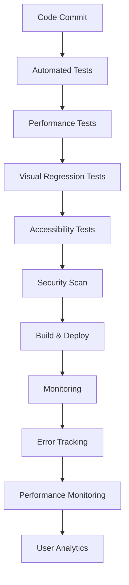

# DataPrism Analytics Demo - Phase 3: Polish & Documentation PRP

## Document Information
- **Project**: DataPrism Analytics Demo Application
- **Phase**: 3 - Polish & Documentation
- **Version**: 1.0
- **Date**: 2025-07-13
- **Status**: Planning
- **Prerequisites**: Phase 1 & 2 Complete

## Executive Summary

Phase 3 transforms the DataPrism Analytics Demo from a feature-complete application into a production-ready showcase that serves as both a powerful demonstration tool and comprehensive learning resource. This phase focuses on user experience optimization, comprehensive documentation, performance refinement, and creating the supporting materials needed for successful product launches and developer adoption.

## Success Criteria

### Primary Goals
- ✅ Demo app achieves production-quality user experience
- ✅ Comprehensive documentation enables self-service adoption
- ✅ Performance optimizations deliver consistent, reliable experience
- ✅ Supporting materials facilitate successful product demos
- ✅ Accessibility standards ensure inclusive user experience

### Key Performance Indicators
- **User Experience**: 90% task completion rate without assistance
- **Performance**: 95% of operations complete within SLA targets
- **Documentation**: 85% of user questions answered by docs
- **Accessibility**: WCAG 2.1 AA compliance achieved
- **Demo Effectiveness**: 80% of viewers understand value proposition

## Feature Requirements

### 1. User Experience Enhancement

#### 1.1 Guided Tutorial System
**Priority**: P0 (Critical)
**Estimated Effort**: 5 days

**Requirements**:
- Interactive onboarding flow for new users
- Contextual help system with tooltips and overlays
- Progressive disclosure of advanced features
- Tutorial completion tracking and resumption
- Multiple learning paths based on user goals

**Acceptance Criteria**:
- New users complete basic tutorial in <10 minutes
- Contextual help appears for complex features
- Users can skip/restart tutorials at any time
- Tutorial state persists across browser sessions
- Different tutorials for analysts, developers, and executives

**Technical Specifications**:
```typescript
interface TutorialSystem {
  currentTutorial?: TutorialFlow;
  completedTutorials: string[];
  userType: 'analyst' | 'developer' | 'executive' | 'explorer';
  
  startTutorial: (tutorialId: string) => void;
  nextStep: () => void;
  skipTutorial: () => void;
  showContextualHelp: (featureId: string) => void;
}

interface TutorialFlow {
  id: string;
  name: string;
  description: string;
  estimatedTime: number;
  steps: TutorialStep[];
  prerequisites?: string[];
}

interface TutorialStep {
  id: string;
  title: string;
  description: string;
  target?: string; // CSS selector for highlight
  action?: 'click' | 'upload' | 'type' | 'wait';
  validation?: () => boolean;
  skipAllowed: boolean;
}
```

#### 1.2 Smart Defaults and Presets
**Priority**: P0 (Critical)
**Estimated Effort**: 4 days

**Requirements**:
- Intelligent chart type suggestions based on data characteristics
- Pre-configured dashboard templates for common use cases
- Smart SQL query templates and autocomplete
- Automatic data type detection and formatting
- Context-aware feature recommendations

**Acceptance Criteria**:
- Chart type selector highlights recommended options
- Dashboard templates cover 80% of common analytics scenarios
- SQL autocomplete suggests relevant tables and columns
- Data formatting automatically matches detected patterns
- Feature recommendations appear based on current workflow

#### 1.3 Advanced Search and Navigation
**Priority**: P1 (Important)
**Estimated Effort**: 3 days

**Requirements**:
- Global search across datasets, queries, and visualizations
- Command palette for quick feature access
- Keyboard shortcuts for power users
- Breadcrumb navigation with context switching
- Recently used items and favorites system

**Acceptance Criteria**:
- Search returns relevant results in <200ms
- Command palette accessible via Ctrl/Cmd+K
- All major features have keyboard shortcuts
- Navigation maintains context across page transitions
- Favorites and recent items persist across sessions

#### 1.4 Responsive Design Optimization
**Priority**: P1 (Important)
**Estimated Effort**: 3 days

**Requirements**:
- Mobile-optimized layouts for tablets and phones
- Touch-friendly interaction patterns
- Adaptive chart sizing and layout
- Progressive web app capabilities
- Offline functionality for core features

**Acceptance Criteria**:
- App functions on tablets (768px+) and phones (360px+)
- Touch gestures work for chart interaction
- Charts resize appropriately on orientation change
- PWA installs and works offline for basic features
- Performance remains consistent across devices

### 2. Comprehensive Documentation

#### 2.1 Interactive Documentation Portal
**Priority**: P0 (Critical)
**Estimated Effort**: 6 days

**Requirements**:
- Comprehensive API documentation with examples
- Feature documentation with screenshots and videos
- Searchable knowledge base with categories
- Interactive code examples and playground
- Community Q&A and discussion forums

**Acceptance Criteria**:
- All public APIs documented with TypeScript signatures
- Feature docs include step-by-step instructions
- Search finds relevant documentation in <1 second
- Code examples are executable and editable
- FAQ section covers 90% of common questions

**Technical Specifications**:
```typescript
interface DocumentationSite {
  sections: {
    gettingStarted: GettingStartedGuide;
    apiReference: APIDocumentation;
    tutorials: Tutorial[];
    examples: CodeExample[];
    troubleshooting: TroubleshootingGuide;
  };
  search: SearchEngine;
  feedback: FeedbackSystem;
}

interface APIDocumentation {
  modules: APIModule[];
  interfaces: TypeDefinition[];
  examples: UsageExample[];
  changelog: ChangelogEntry[];
}

interface CodeExample {
  id: string;
  title: string;
  description: string;
  difficulty: 'beginner' | 'intermediate' | 'advanced';
  code: string;
  data?: any[];
  runnable: boolean;
}
```

#### 2.2 Video Tutorial Library
**Priority**: P1 (Important)
**Estimated Effort**: 5 days

**Requirements**:
- Professional video tutorials for key workflows
- Screen recordings with clear narration
- Closed captions and transcripts
- Video chapters and timestamps
- Downloadable resources and sample files

**Acceptance Criteria**:
- 10+ high-quality tutorial videos (5-15 minutes each)
- Videos cover end-to-end workflows
- Captions available in English with proper timing
- Chapter markers enable quick navigation
- Sample datasets and files downloadable

#### 2.3 Developer Integration Guides
**Priority**: P1 (Important)
**Estimated Effort**: 4 days

**Requirements**:
- SDK documentation with code samples
- Integration guides for popular frameworks
- Deployment and hosting recommendations
- Security best practices and guidelines
- Performance optimization cookbook

**Acceptance Criteria**:
- React, Vue, Angular integration examples
- Deployment guides for Vercel, Netlify, AWS
- Security checklist with implementation details
- Performance guide with benchmarking tools
- Migration guides from competing platforms

#### 2.4 About Page Enhancement
**Priority**: P1 (Important)
**Estimated Effort**: 3 days

**Requirements**:
- Comprehensive technical architecture overview
- Interactive feature comparison tables
- Performance benchmark demonstrations
- Technology deep-dives with diagrams
- Roadmap and future development plans

**Acceptance Criteria**:
- Architecture diagrams explain system design
- Feature comparisons highlight competitive advantages
- Benchmarks demonstrate performance claims
- Technical sections appropriate for developer audience
- Roadmap shows clear development trajectory

### 3. Performance Optimization

#### 3.1 Advanced Performance Monitoring
**Priority**: P0 (Critical)
**Estimated Effort**: 4 days

**Requirements**:
- Real User Monitoring (RUM) integration
- Performance budget enforcement
- Automated performance regression detection
- Core Web Vitals tracking and optimization
- Resource usage analytics and reporting

**Acceptance Criteria**:
- Performance metrics collected from real users
- Alerts triggered when performance budgets exceeded
- Automated tests fail on performance regressions
- Core Web Vitals meet "Good" thresholds
- Performance reports guide optimization efforts

**Technical Specifications**:
```typescript
interface PerformanceBudget {
  metrics: {
    firstContentfulPaint: number; // ms
    largestContentfulPaint: number; // ms
    cumulativeLayoutShift: number; // score
    firstInputDelay: number; // ms
    totalBlockingTime: number; // ms
  };
  resources: {
    totalSizeLimit: number; // bytes
    chunkSizeLimit: number; // bytes
    assetSizeLimit: number; // bytes
  };
  runtime: {
    memoryUsageLimit: number; // MB
    queryTimeoutLimit: number; // ms
    chartRenderTimeLimit: number; // ms
  };
}
```

#### 3.2 Code Splitting and Lazy Loading
**Priority**: P0 (Critical)
**Estimated Effort**: 3 days

**Requirements**:
- Route-based code splitting for faster initial load
- Component-level lazy loading for large features
- Dynamic imports for optional libraries
- Progressive enhancement for advanced features
- Intelligent preloading based on user behavior

**Acceptance Criteria**:
- Initial bundle size <300KB gzipped
- Each route loads only required code
- Advanced features load on-demand
- Preloading improves perceived performance
- Fallbacks available when features fail to load

#### 3.3 Data Processing Optimization
**Priority**: P1 (Important)
**Estimated Effort**: 4 days

**Requirements**:
- Web Workers for CPU-intensive operations
- Streaming data processing for large files
- Virtual scrolling for large datasets
- Intelligent caching with cache invalidation
- Memory management and garbage collection optimization

**Acceptance Criteria**:
- Large file processing doesn't block UI
- Virtual scrolling handles 100K+ rows smoothly
- Cache hit rate >80% for repeated operations
- Memory usage remains stable during extended use
- Processing speed competitive with desktop tools

#### 3.4 Network Optimization
**Priority**: P1 (Important)
**Estimated Effort**: 2 days

**Requirements**:
- CDN optimization for global distribution
- Resource compression and minification
- HTTP/2 server push for critical resources
- Service worker caching strategy
- Bandwidth-adaptive loading

**Acceptance Criteria**:
- Assets load from geographically close CDN
- All resources properly compressed and cached
- Critical resources preloaded appropriately
- Offline functionality through service worker
- App adapts to connection speed

### 4. Accessibility and Internationalization

#### 4.1 WCAG 2.1 AA Compliance
**Priority**: P0 (Critical)
**Estimated Effort**: 5 days

**Requirements**:
- Screen reader compatibility throughout
- Keyboard navigation for all interactive elements
- High contrast mode and color accessibility
- Focus management and visual indicators
- Alternative text for charts and visualizations

**Acceptance Criteria**:
- All features usable with screen reader
- Tab navigation reaches all interactive elements
- Color contrast ratios meet WCAG AA standards
- Focus indicators clearly visible
- Chart data accessible through data tables

**Technical Specifications**:
```typescript
interface AccessibilityFeatures {
  screenReader: {
    ariaLabels: Record<string, string>;
    liveRegions: LiveRegion[];
    skipLinks: SkipLink[];
  };
  keyboard: {
    shortcuts: KeyboardShortcut[];
    focusManagement: FocusManager;
    tabOrder: TabOrderConfig;
  };
  visual: {
    highContrast: boolean;
    reducedMotion: boolean;
    fontSize: 'small' | 'medium' | 'large';
  };
}
```

#### 4.2 Internationalization Framework
**Priority**: P1 (Important)
**Estimated Effort**: 4 days

**Requirements**:
- Multi-language support framework
- Locale-aware number and date formatting
- Right-to-left (RTL) language support
- Currency and measurement unit localization
- Translation management system

**Acceptance Criteria**:
- UI supports English, Spanish, French, German
- Numbers and dates format according to locale
- RTL languages display correctly
- Currency symbols and formats match locale
- Translation updates deployable without code changes

### 5. Testing and Quality Assurance

#### 5.1 Comprehensive Test Suite
**Priority**: P0 (Critical)
**Estimated Effort**: 5 days

**Requirements**:
- End-to-end testing for critical user journeys
- Visual regression testing for UI consistency
- Performance testing with realistic datasets
- Cross-browser compatibility testing
- Mobile device testing on real devices

**Acceptance Criteria**:
- E2E tests cover 90% of user workflows
- Visual tests catch UI regressions automatically
- Performance tests validate SLA compliance
- App tested on Chrome, Firefox, Safari, Edge
- Mobile testing covers iOS and Android devices

#### 5.2 Error Monitoring and Reporting
**Priority**: P0 (Critical)
**Estimated Effort**: 3 days

**Requirements**:
- Real-time error tracking and alerting
- User session recording for debugging
- Performance issue detection and reporting
- Error categorization and prioritization
- Automated bug report generation

**Acceptance Criteria**:
- Errors detected and reported within 1 minute
- Session recordings help reproduce bugs
- Performance issues automatically categorized
- Critical errors trigger immediate alerts
- Bug reports include reproduction steps

#### 5.3 User Acceptance Testing
**Priority**: P1 (Important)
**Estimated Effort**: 4 days

**Requirements**:
- Beta testing program with real users
- Usability testing sessions with feedback
- A/B testing for feature variations
- User journey analytics and optimization
- Feedback collection and analysis system

**Acceptance Criteria**:
- 50+ beta users test core workflows
- Usability sessions identify pain points
- A/B tests inform design decisions
- User journeys optimized based on analytics
- Feedback systematically analyzed and prioritized

## Technical Architecture

### Enhanced Quality Assurance Pipeline



### Documentation Generation System

```typescript
// Automated documentation generation
interface DocumentationGenerator {
  generateAPIDocs: (sourceFiles: string[]) => APIDocumentation;
  generateTutorials: (workflows: Workflow[]) => Tutorial[];
  generateExamples: (codeSnippets: CodeSnippet[]) => CodeExample[];
  validateDocumentation: () => ValidationResult[];
}

// Interactive example system
interface ExamplePlayground {
  executeCode: (code: string, data: any[]) => Promise<ExecutionResult>;
  shareExample: (example: CodeExample) => string; // shareable URL
  forkExample: (exampleId: string) => CodeExample;
  embedExample: (exampleId: string) => EmbedCode;
}
```

### Performance Monitoring Dashboard

```typescript
class PerformanceOptimizer {
  private budgets: PerformanceBudget;
  private metrics: PerformanceMetrics[] = [];
  
  validatePerformance(): ValidationResult {
    const currentMetrics = this.getCurrentMetrics();
    const violations = this.checkBudgetViolations(currentMetrics);
    
    return {
      passed: violations.length === 0,
      violations,
      recommendations: this.generateRecommendations(violations)
    };
  }
  
  optimizeAutomatically(): OptimizationResult {
    const optimizations = [
      this.enableCodeSplitting(),
      this.optimizeImages(),
      this.enableCaching(),
      this.minimizeBundle()
    ];
    
    return {
      applied: optimizations.filter(o => o.success),
      failed: optimizations.filter(o => !o.success),
      performanceGain: this.measurePerformanceGain()
    };
  }
}
```

## Dependencies and Libraries

### Documentation and Testing
```json
{
  "devDependencies": {
    "@storybook/react": "^7.4.0",
    "@storybook/addon-docs": "^7.4.0",
    "typedoc": "^0.25.0",
    "playwright": "^1.40.0",
    "lighthouse": "^11.3.0",
    "@axe-core/react": "^4.8.0",
    "jest-axe": "^8.0.0",
    "chromatic": "^7.5.0",
    "bundlesize": "^0.18.1",
    "web-vitals": "^3.5.0"
  },
  "dependencies": {
    "react-hotjar": "^6.0.0",
    "react-error-boundary": "^4.0.11",
    "react-helmet-async": "^1.3.0",
    "react-i18next": "^13.5.0",
    "fuse.js": "^7.0.0"
  }
}
```

### Production Monitoring
```json
{
  "dependencies": {
    "@sentry/react": "^7.80.0",
    "@sentry/tracing": "^7.80.0",
    "hotjar": "^1.0.1",
    "google-analytics": "^0.4.1",
    "mixpanel-browser": "^2.47.0"
  }
}
```

## Success Metrics

### User Experience Metrics
- 📊 Tutorial completion rate >80%
- 📊 Feature discovery rate >70% within 30 days
- 📊 User retention >60% after 7 days
- 📊 Task completion rate >90% for primary workflows
- 📊 Support ticket volume <5% of active users

### Performance Metrics
- ⚡ First Contentful Paint <1.5 seconds
- ⚡ Largest Contentful Paint <2.5 seconds
- ⚡ Cumulative Layout Shift <0.1
- ⚡ First Input Delay <100ms
- 💾 Memory usage <500MB for typical workflows

### Quality Metrics
- ✅ Accessibility audit score >95%
- ✅ Cross-browser compatibility >98%
- ✅ Error rate <0.1% of user sessions
- ✅ Performance budget compliance 100%
- ✅ Test coverage >90% for critical paths

### Documentation Metrics
- 📚 Documentation coverage for 100% of public APIs
- 📚 User question resolution through docs >85%
- 📚 Tutorial completion without assistance >80%
- 📚 Developer onboarding time <2 hours
- 📚 Example code execution success rate >95%

## Delivery Timeline

### Week 1-2: User Experience Enhancement
- Days 1-5: Guided tutorial system implementation
- Days 6-9: Smart defaults and presets
- Days 10-14: Search, navigation, and responsive design

### Week 3-4: Documentation Development
- Days 15-20: Interactive documentation portal
- Days 21-25: Video tutorial creation and developer guides
- Days 26-28: About page enhancement

### Week 5-6: Performance and Accessibility
- Days 29-32: Performance monitoring and optimization
- Days 33-37: Accessibility compliance and i18n framework
- Days 38-42: Code splitting and network optimization

### Week 7-8: Testing and Quality Assurance
- Days 43-47: Comprehensive test suite and error monitoring
- Days 48-52: User acceptance testing and feedback integration
- Days 53-56: Final polish and launch preparation

## Launch Preparation

### Marketing Materials
- Product demo videos (3-5 minutes)
- Feature highlight reels
- Developer testimonials
- Benchmark comparisons
- Case study presentations

### Developer Resources
- GitHub repository with examples
- NPM package documentation
- Integration tutorials
- Community Discord/Slack
- Developer blog posts

### Business Materials
- Executive summary presentations
- ROI calculation tools
- Competitive analysis documents
- Pricing and licensing guides
- Partnership opportunity briefs

## Post-Launch Support

### Monitoring and Maintenance
- Real-time performance monitoring
- User behavior analytics
- Error tracking and resolution
- Security vulnerability scanning
- Dependency update management

### Community Building
- Developer forum moderation
- Regular community calls
- Open source contribution guidelines
- Feature request prioritization
- User success story collection

### Continuous Improvement
- Monthly performance reviews
- Quarterly feature updates
- Annual major version releases
- User feedback integration cycles
- Competitive feature analysis

Phase 3 delivers a production-ready DataPrism Analytics Demo that serves as both a powerful showcase and comprehensive learning platform, enabling successful product adoption and community building.